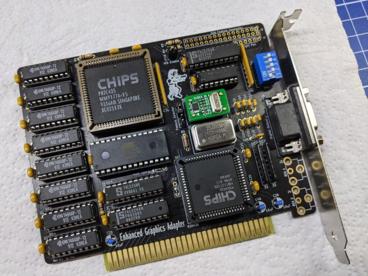

# Enhanced Graphics Adapter

## Introduction

This board is and EGA clone based on a reversed **PA-WTEGA** card, based on the chipset by **CHIPS** (P82C435 + P82A436). 

### Disclaimer

I take NO responsibility for what happens if you decide to build and use this card. Your computer might crash, catch fire or be destroyed in other nasty ways.
You're encourauged to take what you deem fit from this, and use it in your projects!

### Configuration

The card as a bank of 5 dipswitches. Dipswitch 1-4 select the card video output mode, dipswitch 5 selects the IO address.

0 means switch open, 1 means closed.

* Jumpers 1-4:
    * 0-1-0-0: MDA Mode (main)
    * 1-0-0-1: CGA 40x25 (main)
    * 1-0-0-0: CGA 80x25 (main)
    * 0-1-1-1: EGA 200 lines (main)
    * 0-1-1-0: EGA 350 lines (main)
    * 1-1-1-1: CGA 40x25 (secondary)
    * 1-1-1-0: CGA 80x25 (secondary)
    * 1-1-0-1: EGA 200 lines (secondary)
    * 1-1-0-0: EGA 350 lines (secondary)
* Jumper 5:
    * 0: I/O address range in 3xx **default**
    * 1: I/O address range in 2xx

TODO: Test all the combinations provided in the TEVA-2 card manual

### Functionalities

✅ means I tested the functionality and it works, ❌ means I tested the functionality and found issues, ? means that the functionality has yet to be tested.

* [✅] Display checkup with CheckIt (5154/EGA monitor)
* [✅] Display checkup with CheckIt (5153/CGA monitor)
* [?] Display checkup with CheckIt (5151/MDA monitor)
* [?] Feature Connector
* [?] Light pen input

## Bill of Materials

| Component         | Qty | Type / Value        |
| ----------------- | --- | ------------------- |
| **TODO**          |     |                     |

You can hardwire `JP1` pins 1-2 and `JP2` pins 2-3.

Connectors `RCA 1` and `RCA 2` are useless unless an expansion for the feature connector is used. You can leave them out.

### BIOS

This board was tested with [Phoenix Video Bios V1.02 for P82C435](bios/Phoenix_video_bios_PA-WTEGA_NMC27C256Q.BIN).

Burn it on a 27C256 and plug it in U10.

### Component substitutions

* U15 and U13 can be substituted with HCT equivalents
* U4 is an 'LS244 in the original card, I noticed an improvement in image stability with a MCE2VGA by using an 'F244 

## Known issues

### General issues

These are issues found with this board, but that are **also present in the original model** I cloned.

* Screen tearing detected in Commander Keen 4 and 5 (also happening on DOSBox configured for EGA, also note [here](http://nerdlypleasures.blogspot.com/2014/09/how-many-fps-dos-games-and-framerates.html): `The use of 35 frames, even in a 16-color game like Keen, demonstrates that ID was using VGA, not EGA, to develop the game` )
* Minor graphical glitches during gameplay in Tom & Jerry CAT-astrophe.

### Rev 0.1

* Not really an issue as this is not present in the original card I cloned, but might be worth to add a jumper that can physically connect pin 2 of the DB9 connector to GND and not rely only on the jumper configuration, when using the card with a CGA monitor.

### Rev 0

* Some traces stub are left near the edge connector
* Some traces for sensitive sync signals are routed under the oscillators

## TODO

* ???

## Credits

Thanks to [Sergey Kiselev](https://github.com/skiselev) for his symbol/footprint library!

